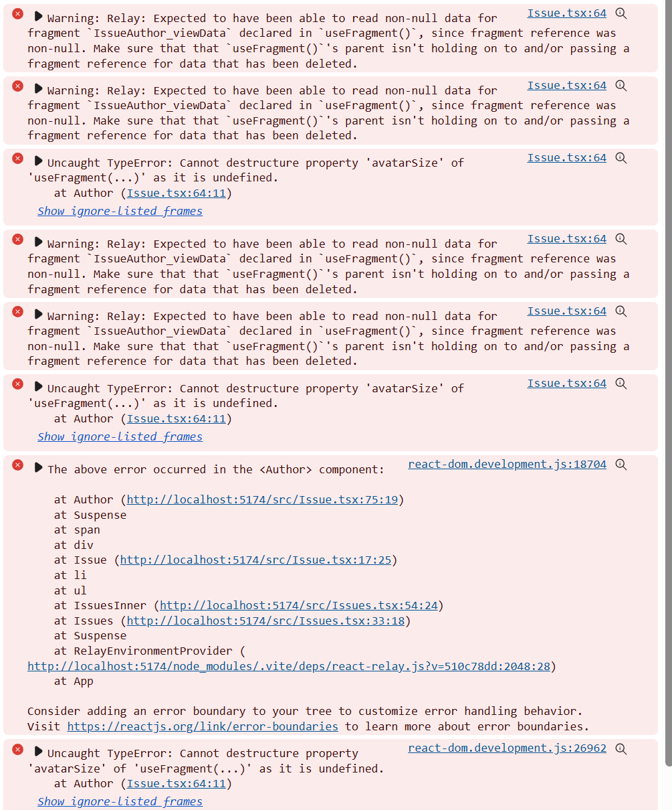

# Relay GC issue repro

This package contains a repro for Relay GC issue where it collects data from Relay resolvers from the store when GC buffer overflows due to some other queries.
This manifests as runtime warnings from Relay and then actual errors due to `useFragment` hook returning `undefined`.
Console logs:

## Installation

1. Generate GitHub PAT and paste it into `.env.local` file in this directory.
2. Run `yarn`.
3. Run `yarn dev` to start a dev server.
4. App will crash immediately with errors from above. If it does not, typing few characters in the search field usually will trigger it.

## Repro setup

1. There is a Relay live resolver (`Query.restIssues` in `issues.resolver.ts`) that fetches a list of issues asynchronously.
2. There are several Relay resolvers for view data that return static objects synchronously (see `viewData.resolver.ts`).
3. `Issues` component uses a combination of `useLazyLoadQuery` and `useRefetchableFragment` to support initial fetch and subsequent refetches when search text changes. `useLazyLoadQuery` on this level includes both data and view data, but down the line these are passed as separate fragment refs.
4. Each `Issue` does a second (waterfall) call to real GraphQL endpoint via `useLazyLoadQuery`.
5. `gcReleaseBufferSize` option on Relay store is set to 0 to make repro easier. If the number is increased, it will still crash eventually after some number of re-queries (in our real app, the buffer size of 15 and the same amount of queries as in this repro is causing errors after 5-10 minutes of app usage).
